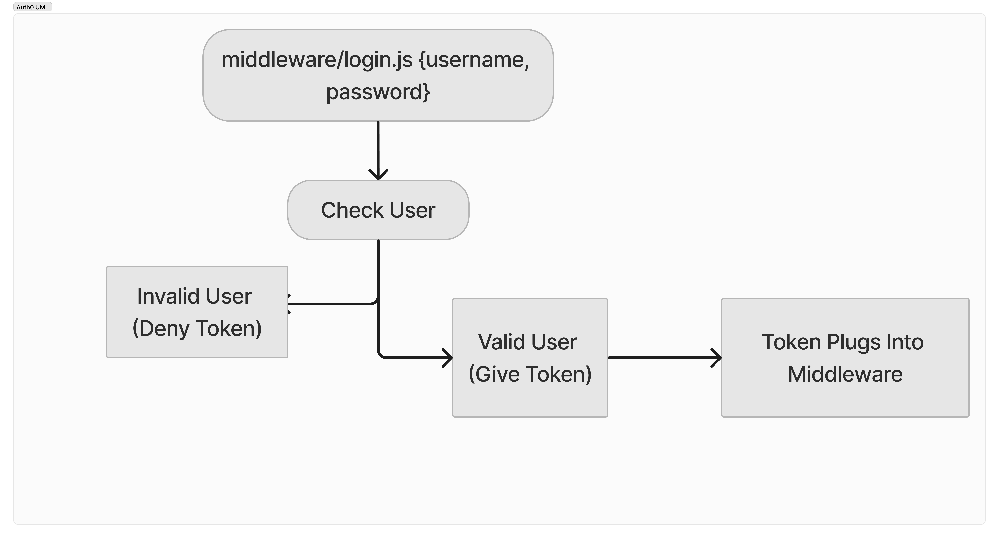
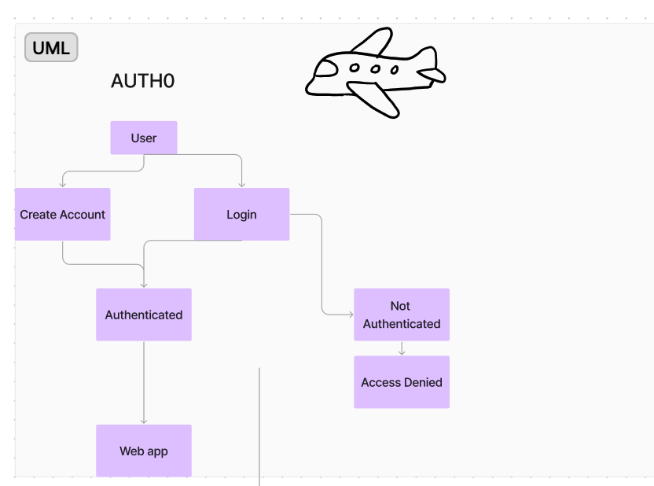
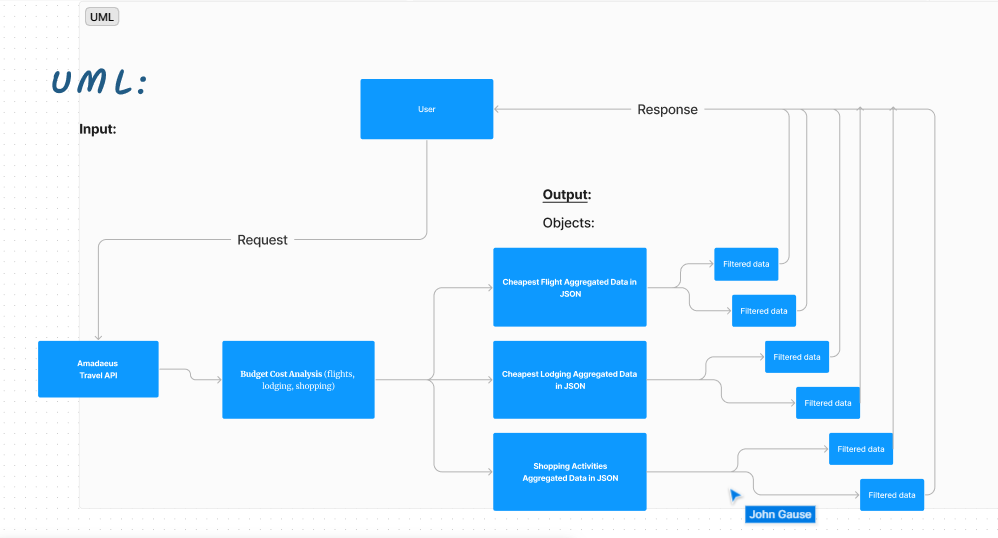

# Code-Voyage

- **Authors**: Ahmed Elnogoumi, Patrick Reveira, John Gause, Mak Trnka
- **Version**: 1.0.0 (increment the patch/fix version number if you make more commits past your first submission)

## 🚀 Overview

- **Project Overview**

The project aims to develop a user-friendly web application to streamline the travel budgeting process. It offers comprehensive budget plans tailored to specific destinations, providing users with estimates for various expenses such as flights, accommodations, and activities.

- **Project Description**

The web application will allow users to input their budget constraints and desired travel details, such as destination, duration, and preferences (e.g., type of place). Based on this information, the app will automatically estimate the cost of the trip, suggest suitable flights, accommodations, and activities within the budget, and calculate the percentage of the budget that could potentially be saved for future trips.

## 🛠️ Getting Started

To run this application on your machine, follow these steps:

- **Install Dependencies**: Run `npm install` to install the required dependencies.
- **Set Environment Variables**: Create a `.env` file in the root directory and add the necessary environment variables.
- **Start Server**: Run `npm start` to start the Express server.

## 🏗️ Architecture

- **UML**

This application is built using the following technologies and libraries:

- **amadeus**: "^10.0.0"
- **auth0**: "^4.3.1"
- **axios**: "^1.6.8"
- **base-64**: "^1.0.0"
- **bcrypt**: "^5.1.1"
- **cors**: "^2.8.5"
- **dotenv**: "^16.4.5"
- **express**: "^4.19.2"
- **express-oauth2-jwt-bearer**: "^1.6.0"
- **inquirer**: "^9.2.20"
- **jest**: "^29.7.0"
- **jsonwebtoken**: "^9.0.2"
- **jwks-rsa**: "^3.1.0"
- **nock**: "^13.5.4"
- **node**: "^22.0.0"
- **nodemon**: "^3.1.0"
- **sequelize**: "^6.37.3"
- **sqlite3"**: "^5.1.7"
- **supertest**: "^7.0.0"

## 🤝 Credit and Collaborations

We extend our heartfelt gratitude to the [Code Voyage Team](https://github.com/Code-Voyage-CF) for their invaluable collaboration and unwavering support during the development of this project.
